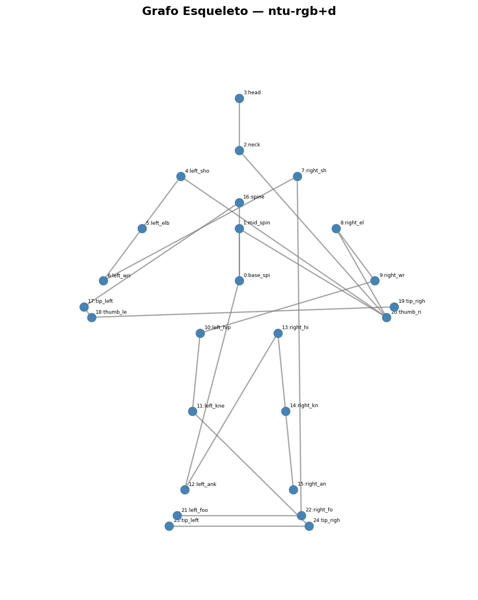
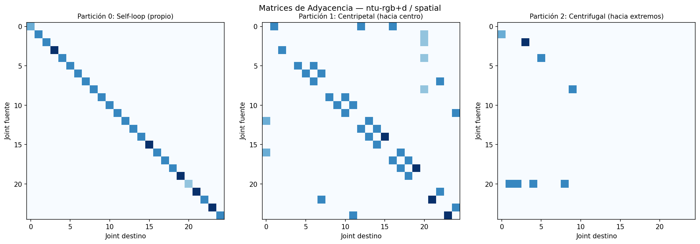
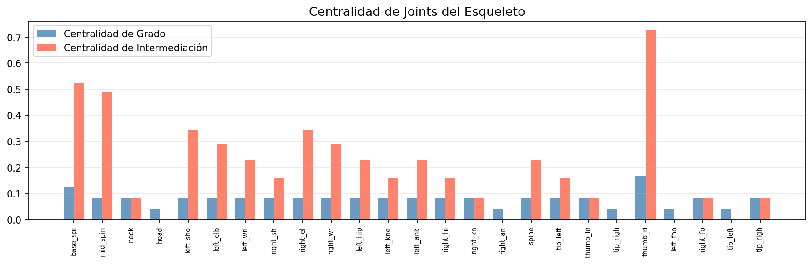
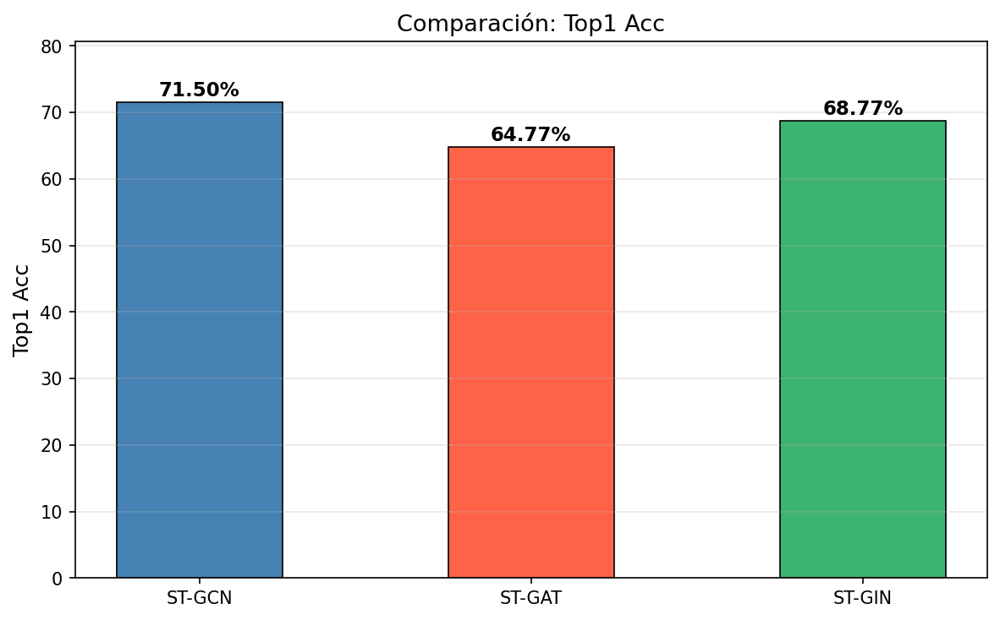
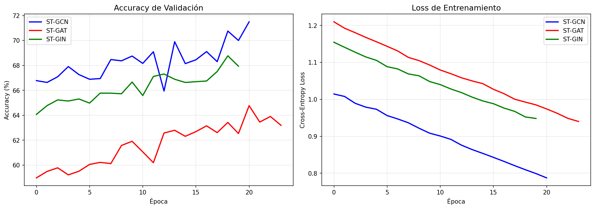
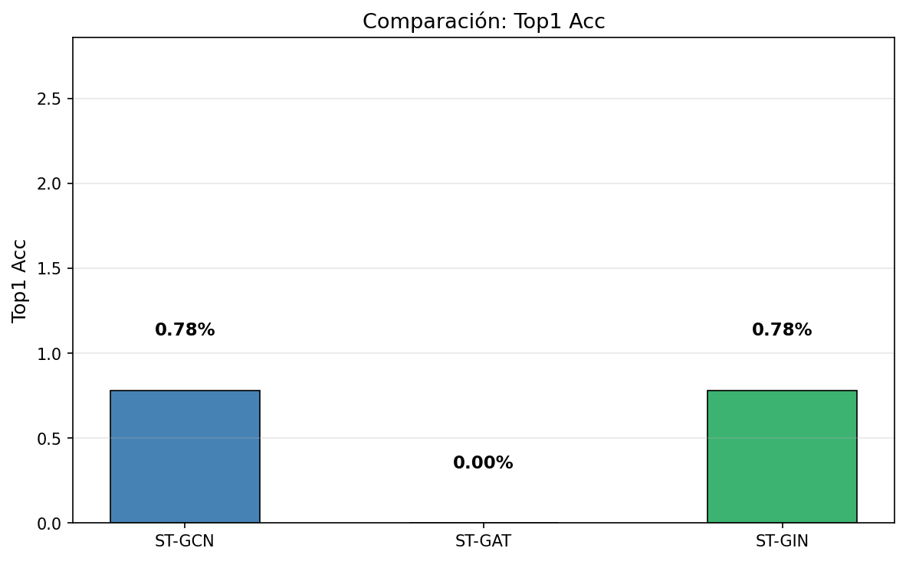
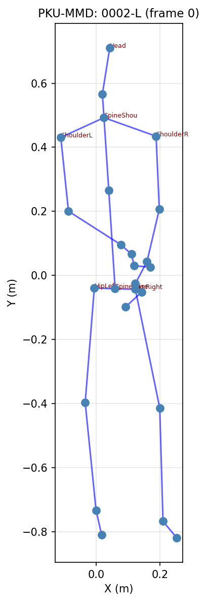
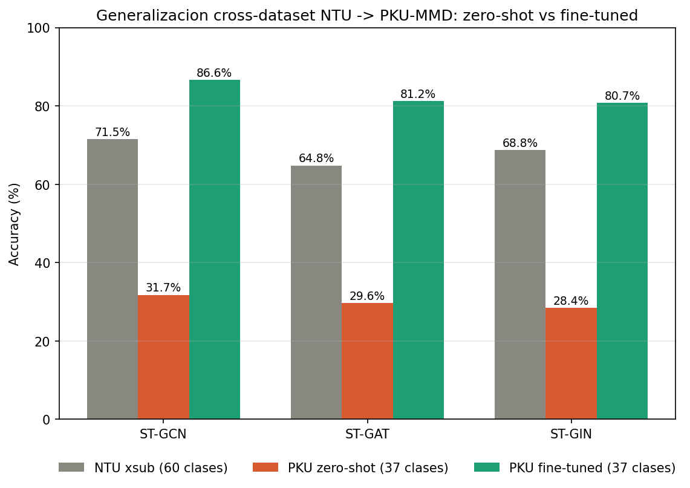

# Contexto completo del proyecto — Estudio comparativo ST-GCN / ST-GAT / ST-GIN

**Curso:** Temas Avanzados de Inteligencia Artificial (1INF61) — Graph Machine Learning
**Universidad:** Pontificia Universidad Católica del Perú (PUCP), 2026-1
**Profesores:** Edwin Alvarez Mamani / Cesar Armando Beltran Castañón
**Grupo:** John Arzapalo, Alessandro Santé, Juan Zavala, Ricardo Lara

Este documento reúne **todo el contexto del proyecto de principio a fin** — no solo la Entrega 3 — para que cualquiera que lo lea (compañero de grupo, el propio autor en el futuro, o quien retome el trabajo) entienda de inmediato qué se hizo, por qué, y dónde está cada cosa.

---

## 1. Qué problema resuelve el proyecto

Reconocimiento de acciones humanas a partir de **datos de esqueleto** (skeleton-based action recognition): dado un video, identificar qué acción realiza la persona (caminar, aplaudir, caer, etc.) usando solo las coordenadas 3D de las articulaciones del cuerpo a lo largo del tiempo, modeladas como un **grafo espacial-temporal**:

- **Nodos** = articulaciones (25 joints en formato Kinect v2: cabeza, hombros, codos, muñecas, caderas, rodillas, etc.)
- **Aristas** = conexiones anatómicas fijas entre articulaciones
- **Dimensión temporal** = secuencia de frames que captura el movimiento

### Pregunta de investigación central

¿Qué arquitectura de Graph Neural Network — GCN (baseline), GAT (atención), o GIN (isomorfismo) — reconoce mejor las acciones, y cuál **generaliza mejor a datos fuera de su dominio de entrenamiento**?

### Preguntas de investigación originales e hipótesis (plan inicial)

Antes de correr ningún experimento, el plan original planteó estas 5 preguntas con hipótesis explícitas — vale la pena conservarlas porque algunas **resultaron incorrectas**, lo cual es en sí un hallazgo:

1. **¿Qué arquitectura logra mayor accuracy en NTU RGB+D?** Hipótesis: GAT > GCN (la atención adapta pesos por contexto). **Resultado real: GCN (71.50%) > GIN (68.77%) > GAT (64.77%)** — la hipótesis fue incorrecta; la agregación simple de GCN superó a la atención de GAT.
2. **¿Qué arquitectura generaliza mejor a un dataset externo?** Hipótesis original: GIN > GCN en Kinetics (mayor capacidad de discriminar estructuras). Kinetics resultó incompatible (sección 6); en la generalización real lograda con PKU-MMD, **GCN lidera en accuracy absoluta zero-shot y fine-tuned, GAT tiene la menor caída relativa** — GIN, el hipotetizado como mejor generalizador, terminó siendo el de mayor caída.
3. ¿Qué joints atiende GAT para acciones de brazos vs. piernas? (análisis cualitativo de mapas de atención — `ST_GNN.get_attention_maps()` en `backbone.py`, pendiente de explotar a fondo en el informe)
4. ¿Cómo afecta el número de capas al over-smoothing en cada arquitectura? (conexión con Unidad 8)
5. ¿Hay diferencia significativa en parámetros vs. rendimiento? GCN 3.10M, GAT 3.09M, GIN 3.35M — prácticamente el mismo presupuesto de parámetros, así que las diferencias de accuracy se explican por la arquitectura, no por capacidad bruta.

### Relación con el sílabo del curso

| Contenido del proyecto | Unidad del curso |
|---|---|
| Grafo del esqueleto: nodos, aristas, tipos | Unidades 2 y 3 |
| BFS, caminos más cortos, conectividad, diámetro | Unidad 4 |
| Centralidad de grado, betweenness, clustering | Unidad 5 |
| Over-smoothing, message passing | Unidad 8 |
| ST-GCN (baseline) | Unidad 9 — GCN |
| ST-GAT (mejora 1) | Unidad 10 — GAT |
| ST-GIN (mejora 2) | Unidad 11 — GIN |

### Referencias académicas principales

| Referencia | Aporte |
|---|---|
| Yan, Xiong & Lin (2018), *ST-GCN*, AAAI 2018 | Arquitectura base: esqueleto como grafo + GCN espacio-temporal |
| Veličković et al. (2018), *Graph Attention Networks*, ICLR 2018 | Base teórica de ST-GAT |
| Xu et al. (2019), *How Powerful are GNNs?*, ICLR 2019 | Base teórica de ST-GIN — equivalente al test de Weisfeiler-Lehman |
| Shahroudy et al. (2016), *NTU RGB+D*, CVPR 2016 | Dataset principal de entrenamiento |
| Kay et al. (2017), *Kinetics*, arXiv 2017 | Dataset de generalización propuesto inicialmente — **descartado**, ver sección 5 |

Repos de referencia: [yysijie/st-gcn](https://github.com/yysijie/st-gcn) (modelo baseline), [open-mmlab/mmskeleton](https://github.com/open-mmlab/mmskeleton) (framework base, extendido para GAT/GIN propios).

Bibliografía de apoyo del curso: Labonne (2023) *Hands-On Graph Neural Networks Using Python*; Broadwater & Stillman (2024) *Neural Networks in Action*; Gross, Yellen & Anderson (2023) *Graph Theory and Its Applications*.

---

## 2. Arquitecturas implementadas

Las 3 arquitecturas comparten el mismo backbone ([proyecto/modelos/backbone.py](proyecto/modelos/backbone.py), clase `ST_GNN`) — **10 bloques espacio-temporales** con dimensiones idénticas al ST-GCN original:

```
64 → 64 → 64 → 64 → 128 → 128 → 128 → 256 → 256 → 256
```

Cada bloque = `[convolución de grafo (GCN/GAT/GIN intercambiable)] → [convolución temporal] → [conexión residual]`. Solo cambia el módulo de convolución de grafo entre las 3 variantes — todo lo demás (temporal conv, batch norm, residual, clasificador final `Conv2d(256, num_class, 1)`) es idéntico, lo que hace la comparación justa.

| Modelo | Módulo | Mecanismo | Parámetros |
|--------|--------|-----------|-------------|
| **ST-GCN** (baseline) | [gconv_gcn.py](proyecto/modelos/gconv_gcn.py) | Suma normalizada por grado sobre matriz de adyacencia fija (`einsum('nkctv,kvw->nctw')`) + `edge_importance` aprendido por capa | 3,098,832 |
| **ST-GAT** (mejora 1) | [gconv_gat.py](proyecto/modelos/gconv_gat.py) | Atención aprendida dinámicamente por vecino (`att_src`/`att_dst`) — permite visualizar qué joints importan más por acción | 3,087,012 |
| **ST-GIN** (mejora 2) | [gconv_gin.py](proyecto/modelos/gconv_gin.py) | Suma sin normalizar + término `(1+ε)·h_self` (ε aprendido por capa) + MLP de 2 capas (BatchNorm+ReLU+Conv2d 1×1) — tan expresivo como el test de Weisfeiler-Lehman | 3,346,480 |

Nota técnica: `edge_importance` (pesos por arista) solo se usa en GCN — en GAT/GIN el gradiente queda bloqueado por la binarización de A, así que no aporta nada y se desactiva automáticamente (`backbone.py`, línea ~111-113).

Nota técnica 2: ST-GIN preserva la dimensión K de particiones espaciales en su tensor intermedio (`einsum('nkctv,kvw->nkctw')`, con `k` en la salida) antes de colapsarla con `sum(dim=1)`, a diferencia de GCN/GAT que la colapsan directamente en el einsum. Esto implica ~3× más memoria intermedia por bloque — detalle que resultó relevante en la Fase 4 de la E3 (sección 6).

El grafo del esqueleto se define en [proyecto/modelos/graph.py](proyecto/modelos/graph.py) (clase `Graph`), con soporte para layout `ntu-rgb+d` (25 nodos) y `openpose` (18 nodos), y estrategia de partición `spatial` (3 particiones: raíz, centrípeta, centrífuga — usada en el proyecto) además de `uniform` y `distance`.

---

## 3. Dataset principal — NTU RGB+D

- 60 clases de acciones, 25 joints (Kinect v2), coordenadas 3D
- Split **cross-subject (xsub)**: ~40,091 clips train (sujetos 1-20) / ~16,487 clips val (sujetos 21-40)
- Formato de entrada al modelo: tensor `(N, C=3, T, V=25, M=2)` — N=batch, T=frames, M=hasta 2 personas
- Carga de datos: [proyecto/dataset_loader.py](proyecto/dataset_loader.py), con `mmap_mode='r'` para carga perezosa de los `.npy` (evita cargar el dataset completo en RAM)

---

## 4. E1 — Análisis estructural del grafo esqueleto

Script: [proyecto/analizar_grafo.py](proyecto/analizar_grafo.py). Cubre directamente las Unidades 2-5 del curso:

- Propiedades básicas (nodos, aristas, tipo de grafo, particiones K de la estrategia 'spatial')
- Conectividad: BFS, diámetro, distancia media entre joints
- Centralidad de grado y betweenness por joint
- Coeficiente de clustering
- Distribución de grados y visualización de las particiones espaciales del grafo

Comando: `python proyecto/analizar_grafo.py --layout ntu-rgb+d`

**Grafo del esqueleto NTU RGB+D (25 joints, particiones espaciales):**



**Matriz de adyacencia:**



**Centralidad de grado y betweenness por joint:**



---

## 5. E2 — Entrenamiento y comparación inicial en NTU RGB+D

Script: [proyecto/train.py](proyecto/train.py), con soporte de `--resume` para continuar desde checkpoint y precisión mixta (`torch.amp.autocast('cuda')` + `GradScaler`).

**Configuración real usada** (difiere de los defaults del script, ajustada por memoria GPU disponible):

| Parámetro | Valor real usado | Default del script |
|---|---|---|
| batch_size | 16 | 32 |
| window (frames) | 300 | 150 |
| Épocas totales | 30 (10 iniciales + resume hasta 30) | 80 |
| LR fase inicial (ép. 1-10) | 0.1 (SGD + momentum 0.9, weight_decay 1e-4) | 0.1 |
| LR fase resume (ép. 11-30) | 0.001 (reducido al continuar) | — |

Entrenamiento ejecutado en dos etapas: épocas 1-10 (los 3 modelos), luego resume hasta época 30 continuando desde `mejor_{modelo}.pth` con `$env:PYTORCH_CUDA_ALLOC_CONF="expandable_segments:True"` para reducir fragmentación de memoria CUDA.

**Resultados finales (best val_acc, split xsub, 60 clases):**

| Modelo | Val accuracy (top-1) | Val top-5 | Val F1 | Parámetros |
|--------|----------------------|-----------|--------|--------------|
| **ST-GCN** | **71.50%** | 93.83% | 71.58% | 3.10M |
| ST-GIN | 68.77% | — | — | 3.35M |
| ST-GAT | 64.77% | — | — | 3.09M |

Fuente: `proyecto/resultados/{gcn,gat,gin}/resultados.json` (incluye curvas completas de loss/accuracy/F1/top-5 por época).

**Comparación de accuracy entre los 3 modelos:**



**Curvas de entrenamiento (loss y accuracy por época):**



Generados por [proyecto/comparar.py](proyecto/comparar.py).

### Informe E1+E2 (Overleaf / IEEEtran)

El informe de 6 páginas (formato IEEEtran) cubre los puntos de rúbrica 1.1–1.7 (E1) y 2.1–2.5 (E2). Se corrigió un bug de referencias cruzadas LaTeX (`\ref{sec:formulacion}` y `\ref{sec:analisis}` aparecían como `??` por falta de `\label{}` en las secciones "Formulación del Problema" y "Análisis Estructural del Grafo Esqueleto") — confirmado resuelto en la versión final del PDF (versión 3).

### Repositorio GitHub

[github.com/JohnArzapalo/TAIA-TAREAACADEMICA](https://github.com/JohnArzapalo/TAIA-TAREAACADEMICA) — usado como entrega de código (el curso acepta el link de GitHub en vez de un único .py/.ipynb). `.gitignore` excluye `*.pth` (checkpoints, demasiado grandes), `*.npy`/`*.pkl` (datos), `__pycache__/`, `datos/`, entornos virtuales.

---

## 6. El intento de generalización con Kinetics — por qué se descartó

El plan original del proyecto proponía evaluar generalización cross-dataset en **Kinetics** (esqueletos pre-extraídos, 18 joints OpenPose, 2D, dataset "Kinetics 5%" de Kaggle). Esto **se intentó realmente** — los resultados quedaron guardados en `proyecto/resultados/generalizacion_kinetics.json`:

| Modelo | Top-1 | Top-5 | F1-macro |
|--------|-------|-------|----------|
| ST-GCN | 0.78% | 2.34% | 0.39% |
| ST-GAT | 0.00% | 2.34% | 0.00% |
| ST-GIN | 0.78% | 2.34% | 0.39% |

Estos números son **esencialmente ruido aleatorio** — no transferencia débil, sino un modelo que literalmente no puede interpretar la entrada. La causa raíz es **incompatibilidad dimensional**, no un problema de dominio:

| | NTU RGB+D (entrenamiento) | Kinetics-Skeleton |
|---|---|---|
| Joints | 25 (Kinect v2) | 18 (OpenPose) |
| Coordenadas | 3D (x, y, z) | 2D (x, y) |
| Clases | 60 | ~400 |

Un modelo entrenado con tensores `(3, T, 25, M)` no puede procesar correctamente datos `(2, T, 18, M)` sin un remapeo de topología de grafo — los resultados cercanos a cero lo confirman empíricamente. Esto fue señalado como crítica técnica al planteamiento original, y motivó la búsqueda de un dataset de generalización **dimensionalmente compatible**: **PKU-MMD** (ver sección 7).



Script usado para este intento: [proyecto/evaluar_kinetics.py](proyecto/evaluar_kinetics.py) (se mantiene en el repo como evidencia del proceso, no se usa en la versión final).

---

## 7. E3 — Generalización cross-dataset con PKU-MMD

### Por qué PKU-MMD es compatible

PKU-MMD usa el **mismo sensor Kinect v2** que NTU → mismo formato: 25 joints, 3D, mismas convenciones de esqueleto. Compatible sin remapeo de topología.

### Pipeline implementado (4 fases)

**Fase 1 — Sanity check** ([pku_sanity_check.py](pku_sanity_check.py)): verifica formato antes de procesar todo el dataset.
- 150 valores/línea (2 personas; se usa persona 1 = primeros 75 valores)
- 25 joints × 3 coords confirmado
- Escala: span Y = 2.01 m → metros, igual que NTU, sin reescalar

Comando: `py -3 pku_sanity_check.py --skel_file "D:/Dataset TAIA/Proyecto/PKUMMD/Data/0002-L.txt"`



**Fase 2 — Preprocesamiento** ([preprocess_pku.py](preprocess_pku.py)): extrae clips con clases comunes NTU↔PKU-MMD.
- Detalle no documentado claramente por PKU-MMD: `Label1pers/*.txt` usa IDs de `Actions1pers.csv` (43 clases de 1 persona, 0-indexado), no de `Actions.csv` (52 clases, incluye interacciones de 2 personas). Formato: `class_id,start_frame,end_frame,confidence` (comas).
- Mapeo `PKU1PERS_TO_NTU`: **37 clases comunes** por correspondencia semántica (ej. Actions1pers "salute" → NTU clase "salute"). Clases sin equivalente (ej. "hopping", "put something inside pocket") se excluyen.
- División oficial por sujetos (`Split/cross-subject-1pers.txt`): Training 968 archivos (14,294 clips) / Validation 108 archivos (2,012 clips) — disjuntos por sujeto, Validation nunca se usa para actualizar pesos → funciona como **test set real**.

Comando: `py -3 preprocess_pku.py --skel_dir "PKUMMD/Data" --label_dir "PKUMMD/Label1pers" --split "PKUMMD/Split/cross-subject-1pers.txt" --split_part train --out_dir "PKUMMD/procesado_train"`

**Fase 3 — Evaluación zero-shot** ([eval_pku.py](eval_pku.py)): checkpoints NTU originales evaluados directo en validación PKU, sin ningún ajuste de pesos.

| Modelo | NTU xsub | PKU top-1 | PKU top-5 | PKU F1 |
|--------|----------|-----------|-----------|--------|
| ST-GCN | 71.50% | 31.75% | 49.14% | 18.20% |
| ST-GAT | 64.77% | 29.60% | 50.14% | 18.00% |
| ST-GIN | 68.77% | 28.42% | 47.65% | 16.61% |

Azar puro sobre 37 clases ≈ 2.7% — los 3 modelos superan el azar ~10×, confirmando transferencia parcial real (a diferencia del ruido puro obtenido con Kinetics en la sección 6).

**Fase 4 — Fine-tuning** ([finetune_pku.py](finetune_pku.py)): ajusta el checkpoint NTU con el split de Training de PKU, evalúa en el mismo split de Validation de la Fase 3.

Problema técnico encontrado y resuelto durante esta fase: con `batch=32`, ST-GIN saturaba la VRAM de la GPU (RTX 3060 Laptop, 6 GB) por su capa de agregación adicional (ver nota técnica 2 en sección 2: ~3× más memoria intermedia que GCN/GAT). Windows usaba *shared GPU memory* (RAM vía PCIe) en vez de fallar, causando una caída de rendimiento de ~20× (confirmado con `nvidia-smi`: P-state P8/210 MHz en vez de P0/2100 MHz, 0% utilización real). Solución aplicada a **los 3 modelos por consistencia metodológica** (no solo a GIN):
- `batch_size`: 32 → **8** (límite seguro de VRAM verificado empíricamente: 1.5-2.5 GB de uso real, lejos de los 6 GB)
- `learning_rate`: 0.001 → **0.00025** (regla de escalamiento lineal, Goyal et al. 2017, para SGD+momentum: LR debe escalar proporcionalmente al batch size)
- `epochs` máx: 25, **early stopping** con `patience=5`, tope de tiempo 120 min/modelo

| Modelo | Épocas corridas | Razón de parada | Mejor val PKU |
|--------|-------------------|-------------------|----------------|
| ST-GCN | 25/25 | Completó el máximo | 86.60% (época 24) |
| ST-GAT | 20/25 | Early stopping (sin mejora en 5 épocas) | 81.17% (época 15) |
| ST-GIN | 19/25 | Early stopping (sin mejora en 5 épocas) | 80.73% (época 14) |

Pipeline completo (las 4 fases, con respaldo automático de resultados zero-shot y tabla comparativa final) corrido en una sola sesión. Tiempo total (3 modelos, batch=8): 4h 47min.

### Resultado final — Zero-shot vs Fine-tuned (comparación válida, mismas 37 clases)

| Modelo | Zero-shot | Fine-tuned | Mejora | Top-5 (FT) | F1 (FT) |
|--------|-----------|------------|--------|------------|---------|
| ST-GCN | 31.75% | **86.60%** | +54.85 pp | 98.46% | 53.23% |
| ST-GAT | 29.60% | 81.17% | +51.57 pp | 97.27% | 49.53% |
| ST-GIN | 28.42% | 80.73% | +52.32 pp | 97.72% | 49.41% |



Resultados completos: [resultados_pku/eval_pku_results_zeroshot.json](resultados_pku/eval_pku_results_zeroshot.json), [resultados_pku/eval_pku_results_pku.json](resultados_pku/eval_pku_results_pku.json).

### ⚠️ Advertencia metodológica importante

Los JSON de resultados incluyen una columna `"drop"` (NTU_acc − PKU_acc) que se vuelve **negativa tras el fine-tuning** (ej. GCN: −15.10 pp). Esto **no significa que el modelo generaliza mejor de lo que se especializa** — es parcialmente artefacto de que NTU evalúa sobre 60 clases y PKU (tras filtrar a clases comunes) sobre solo 37; una tarea de 37 clases es estructuralmente más fácil. **Para el informe: comparar fine-tuned contra zero-shot (mismas 37 clases), no contra NTU directamente.**

### Interpretación / narrativa sugerida para el informe

1. **ST-GCN domina en los tres regímenes** (NTU 71.50%, zero-shot 31.75%, fine-tuned 86.60%) — su agregación más simple parece producir representaciones robustas y adaptables a la vez.
2. **ST-GAT generaliza relativamente mejor en zero-shot** (menor caída, 35.17 pp) a pesar de menor accuracy NTU — su atención podría capturar patrones más agnósticos al dataset de origen, aunque en términos absolutos post fine-tuning queda segundo.
3. **ST-GIN tiene la mayor caída zero-shot y requirió más ingeniería** (restricción de VRAM) — su agregación más expresiva podría sobreajustar más a NTU.
4. El fine-tuning **cierra casi por completo el domain gap** en los 3 modelos (+51 a +55 pp), confirmando que las representaciones NTU son adaptables aunque no perfectamente transferibles zero-shot.
5. **Top-5 ≈ 97-98% tras fine-tuning** en los 3 modelos — alta confiabilidad de "casi-acierto" incluso cuando el top-1 falla.

### Rigor metodológico a destacar

- Diagnóstico de cuello de botella con evidencia (`nvidia-smi`: P-state, VRAM), no solo "se demoró mucho"
- Escalamiento de LR principiado (Goyal et al. 2017), no ad-hoc
- Early stopping con `patience` explícito, mismo criterio para los 3 modelos — no se truncó arbitrariamente ningún entrenamiento
- Condiciones idénticas entre modelos tras detectar la necesidad de ajuste por VRAM — se descartó la primera corrida (batch=32) y se rehízo todo para mantener comparabilidad
- Protocolo cross-subject respetado en ambos datasets (train/val por sujetos distintos)
- El intento fallido con Kinetics (sección 6) se documentó con evidencia empírica en vez de ocultarse, reforzando la justificación del pivote a PKU-MMD

---

## 8. Estructura completa del repositorio

```
TAIA-TAREAACADEMICA/
├── CONTEXTO_PROYECTO.md          ← este documento
├── pku_sanity_check.py           ← E3 Fase 1
├── preprocess_pku.py             ← E3 Fase 2
├── finetune_pku.py               ← E3 Fase 4 (incluye eval con early stopping)
├── eval_pku.py                   ← E3 Fase 3 y 4 (zero-shot y fine-tuned)
├── preprocess_ntu.py             ← preprocesamiento original NTU RGB+D
├── logs_finetune/                ← logs de las 3 fases del fine-tuning, por época
├── resultados/sanity_pku.png     ← plot del sanity check PKU
├── resultados_pku/               ← JSON finales E3 + comparacion_ntu_pku.png
└── proyecto/                     ← código base E1+E2
    ├── modelos/
    │   ├── graph.py               ← grafo del esqueleto (25 joints NTU / 18 OpenPose)
    │   ├── gconv_gcn.py           ← baseline GCN
    │   ├── gconv_gat.py           ← mejora 1: GAT
    │   ├── gconv_gin.py           ← mejora 2: GIN
    │   └── backbone.py            ← ST_GNN unificado, 10 bloques
    ├── utils/
    │   ├── metricas.py            ← top-k accuracy, F1 macro
    │   └── visualizar.py          ← gráficos de atención, curvas, comparación
    ├── configs/                   ← YAMLs de configuración por modelo
    ├── dataset_loader.py          ← carga NTU RGB+D (mmap lazy loading)
    ├── train.py                   ← entrenamiento NTU RGB+D
    ├── evaluar_kinetics.py        ← intento descartado (sección 6)
    ├── analizar_grafo.py          ← análisis E1 (Unidades 2-5)
    ├── comparar.py                ← tablas/plots comparativos E1+E2
    ├── verificacion.py            ← verificación de integridad de datos/modelo
    └── resultados/
        ├── {gcn,gat,gin}/
        │   ├── mejor_{m}.pth           ← checkpoint NTU (no en GitHub, *.pth excluido)
        │   ├── mejor_{m}_pku.pth       ← checkpoint fine-tuned PKU (no en GitHub)
        │   ├── resultados.json         ← curvas NTU completas
        │   └── resultados_pku_{m}.json ← curva de fine-tuning PKU
        ├── backup_batch32/             ← resultados preliminares (batch=32, antes de unificar)
        ├── generalizacion_kinetics.json ← evidencia del intento descartado
        └── *.png                       ← plots de grafo, centralidad, comparación, curvas
```

Checkpoints `.pth` (NTU originales y fine-tuned) **no están en GitHub** por tamaño — solo existen en local.

---

## 9. Estado actual y pendientes

**Completado:**
- [x] E1: análisis estructural del grafo esqueleto (Unidades 2-5)
- [x] E2: entrenamiento de los 3 modelos en NTU RGB+D + informe IEEEtran corregido (versión 3 del PDF)
- [x] Intento de generalización en Kinetics (descartado con evidencia empírica)
- [x] E3: pipeline completo PKU-MMD (sanity check, preprocesamiento, zero-shot, fine-tuning)
- [x] Código pusheado a GitHub como entrega (commits de scripts E3 + este documento)

**Pendiente:**
- [ ] Redactar la sección de informe E3 en Overleaf con las tablas e imágenes de la sección 7 de este documento
- [ ] Incluir la advertencia metodológica sobre conteo de clases (60 vs 37) explícitamente en el texto
- [ ] Verificar referencias cruzadas (`\label`/`\ref`) si se añaden nuevas secciones — mismo bug que en E1+E2 (sección 5)
- [ ] Commitear el `.tex`/PDF final una vez actualizado el informe
